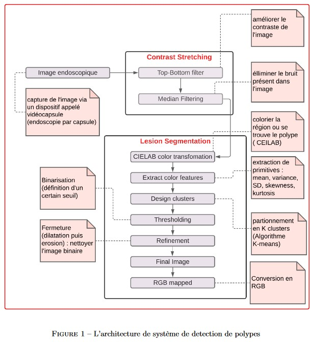

# Deep CNN and geometric features-based gastrointestinal tract diseases detection and classification from wireless capsule endoscopy images
## Introduction
Les infections gastro-intestinales (GIT) telles que les polypes, la maladie de Crohn, les ulcères, les saignements
et le cancer sont aujourd’hui très fréquentes dans le monde entier. Bien qu’elles ne soient pas toujours sévères, elles
peuvent dans certains cas s’avérer mortelles.
L’endoscopie capsulaire (WCE) est un moyen efficace d’investigation du GIT maladies. cependant celles-ci pré-
sentent de nombreuses limites étant donné les difficultés liées à la détection de polypes tels que la forme, la couleur,
la texture, la taille et irrégularité de la lésion. Pour faire face à ces problèmes, plusieurs méthodes informatiques
sont introduites dans le domaine de la vision par ordinateur avec des techniques d’intelligence artificiel, mais ils ont
utilisé que des fonctionnalités artisanales qui produisent des fausses prédictions à plusieurs reprises.
Dans cet article, une nouvelle technique est appliquée par : Muhammad Sharif, Muhammad Attique Khan,
Muhammad Rashid, Mussarat Yasmin, Farhat Afza and Urcun John Tanik en février 2019 suite à une recherche basée
sur la fusion de deux méthodes : Deep CNN and geometric features-based gastrointestinal tract diseases detection.
Initialement, les régions de la maladie sont extraites à partir des images endoscopiques données en utilisant une
nouvelle approche appelée contrast-enhanced colour features. Par la suite, les caractèrestiques sélectionnées seront
classifiés par la méthode K-Nearest Neighbour.
Une base de données privée qui se compose de 5500 images endoscopiques est utilisé pour l’évaluation de la
méthode posée : (http://www.depeca.uah.es/colonoscopy_dataset/)

## Architecture de système de detection de polypes

